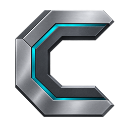

<p align="center">
  
</p>

# Complemetal

> **Development branch note — `neoforge-1.21.1-port`**
>
> This branch is the active Minecraft 1.21.1 NeoForge port. It targets NeoForge 21.1.252, Sodium 0.6.13, Iris 1.8.12, and Java 21 on Apple Silicon. The stable-release documentation below describes the upstream 0.4.1 Fabric/Minecraft 26.2 release and is retained for project lineage; the branch-specific build and verification instructions later in this file apply to this port.
>
> The port keeps the native Metal runtime and experimental Iris translation/Metal 4 graph work behind validation and fail-open gates. A failed Metal or Iris integration must leave the vanilla/Iris OpenGL path usable.

[GitHub release](https://github.com/daniiarkg/complemetal-mc/releases/tag/v0.4.1%2Bmc26.2)
· [Modrinth](https://modrinth.com/mod/complemetal)
· [Architecture graphs](docs/ARCHITECTURE_GRAPH.md)

Complemetal is an Apple Silicon rendering project for Minecraft Java 26.2. It
combines a Metal 4 runtime, a native hybrid terrain renderer, and an advanced
Iris GLSL -> SPIR-V -> MSL pipeline while preserving a strict fail-open path
for real shader-pack play.

Release `0.4.1` is the stability release. With an Iris shader pack active,
Iris/OpenGL deliberately remains the visible renderer and Complemetal does not
allocate a second set of world meshes, texture mirrors, or entity/particle GPU
buffers. This fixes the severe FPS regression, black-world failure, and crash
reported against `0.4.0` while keeping the Metal 4 and shader-translation
foundation available for further qualification.

## Origin

Complemetal is a continuation and fork of
[MetalRender by pebbles_boon / webblepebbles](https://github.com/webblepebbles/MetalRender).
The upstream project supplied the original Apple Silicon Metal renderer
foundation. The Minecraft 26.2 port, Iris translation/compiler path, complete
pipeline and resource capture, Metal render graph, parity/cutover system,
display lifecycle hardening, compatibility work, and release QA were developed
in this fork.

See [project lineage and attribution](docs/LINEAGE.md) and [NOTICE](NOTICE).
The project remains under Apache License 2.0.

> Complemetal is not affiliated with or endorsed by Apple, Mojang, Microsoft,
> Iris, Sodium, or the Complementary shader-pack authors.

## Stable release contract

| Component | Validated configuration |
| --- | --- |
| Complemetal | `0.4.1+mc26.2` |
| Minecraft | Java Edition 26.2 |
| Loader | Fabric Loader 0.19.3 |
| Fabric API | 0.156.0+26.2 |
| Java | 25 |
| Platform | Apple Silicon, macOS 26+, Metal 4 runtime |
| Iris | 1.11.2 for Minecraft 26.2 |
| Sodium | 0.9.1 for Minecraft 26.2 |
| Shader-pack acceptance workload | Complementary Reimagined r5.8.1, Ultra preset |
| Additional tested mods | ImmediatelyFast, Entity Culling, Lithium, FerriteCore, Mod Menu, YACL, Zoomify, Placeholder API |
| Iris visible-frame owner | Iris/OpenGL in the stable profile |
| Experimental Iris Metal graph | Implemented, but explicit opt-in only and outside the `0.4.1` support contract |
| Unsupported state | Safe Iris/OpenGL or Minecraft fallback |

The packaged native library is arm64-only and has a macOS 14 deployment
target. The declared release matrix is narrower because the Metal 4 path and
Minecraft 26.2 qualification were performed on macOS 26.

## What runs through Metal

Without an active Iris shader pack, Complemetal can use its native hybrid
terrain path and a fenced IOSurface presentation bridge. With Iris active in
`0.4.1`, the stable profile keeps the complete visible shader graph on
Iris/OpenGL. The Metal runtime remains initialized, but duplicate terrain work
is deferred.

The repository also contains the completed experimental shader pipeline:

```text
Iris final transformed GLSL
  -> shaderc SPIR-V with OpenGL semantics
  -> SPIRV-Cross reflection and MSL
  -> Apple MTLLibrary validation
  -> render-state-specific Metal pipelines and archive
  -> persistent Metal graph resources
  -> MTL4 passes, draws, transfers, and barriers
  -> visual-parity and ownership gates
  -> fenced IOSurface presentation
```

That pipeline is not automatically enabled in the stable JAR. Version or
hardware detection alone is not proof that a live frame is safe to suppress.
This boundary is the central `0.4.1` correction.

## Fullscreen performance and stability evidence

The final release JAR was tested twice in the official Minecraft 26.2/Fabric
production runtime. Both sides used the same Complementary Reimagined r5.8.1
Ultra configuration, 15-chunk render distance, 13-chunk simulation distance,
full compatibility mod set, worlds, camera routes, and physical fullscreen
mode on a 200 Hz display.

| Metric | Complemetal enabled | Same JAR disabled | Difference |
| --- | ---: | ---: | ---: |
| Average FPS, 30 s stationary window | 58.01 | 51.21 | +13.29% |
| 1% low FPS | 36.74 | 36.14 | +1.68% |
| Frame-time p50 | 17.86 ms | 19.45 ms | -8.17% |
| Frame-time p95 | 25.43 ms | 26.74 ms | -4.91% |
| Frame-time p99 | 27.22 ms | 27.67 ms | -1.65% |
| Retained heap after two full GCs | 445.5 MB | 456.7 MB | -11.2 MB |

Both runs used 1920x1080 fullscreen at 200 Hz and ran for more than one minute.
The enabled side passed all 14 non-black screenshot gates, flight and chunk
streaming, survival mining, Zoomify input, live Complemetal reload, resource
reload, Overworld/Nether/End transitions, biome changes, entities, fluids,
night, rain, and a second world. It recorded zero GPU command-buffer errors,
zero in-flight timeouts, zero unsafe IOSurface-slot skips, and no crash report.

The +13.29% result is one controlled paired run, not a universal promise and
not proof that Iris rendering was accelerated through Metal: the stable Iris
frame remained on OpenGL. The release claim is narrower and stronger—enabling
Complemetal no longer causes the catastrophic slowdown seen in `0.4.0` and did
not regress this qualified workload.

## Install

1. Install Minecraft 26.2, Fabric Loader, Fabric API, Sodium, and Iris.
2. Run the instance with Java 25 on an Apple Silicon Mac.
3. Remove older `complemetal-*.jar` or `metalrender-*.jar` builds from `mods/`.
4. Place `complemetal-0.4.1+mc26.2.jar` in `mods/`.
5. Select the shader pack and run `/complemetal status` in a world.

Download the exact release JAR from
[GitHub Releases](https://github.com/daniiarkg/complemetal-mc/releases/tag/v0.4.1%2Bmc26.2)
or [Modrinth](https://modrinth.com/mod/complemetal).

## Migration from MetalRender

- Fabric mod id: `complemetal`; metadata also provides the legacy
  `metalrender` alias.
- Primary commands: `/complemetal` and `/cm`.
- Legacy commands: `/metalrender` and `/mr` remain available.
- New config: `config/complemetal.json`.
- Existing `config/metalrender.json` is imported when the new config is absent;
  the legacy file is left intact as a backup.
- Java packages, JNI exports, `libmetalrender.dylib`, cache formats, and
  `metalrender.*` JVM properties remain internal compatibility boundaries.

## Build and verify

Development checks:

```bash
./gradlew --no-daemon test compileGametestJava checkJniParity \
  testExactJarQaValidators
./gradlew --no-daemon runClientGameTest
```

### NeoForge 1.21.1 Iris development branch

The `neoforge-1.21.1-port` branch targets Minecraft 1.21.1 with NeoForge
21.1.252, Sodium 0.6.13, and Iris 1.8.12. Its Iris mixin configuration now
registers the 1.21.1 Sodium terrain-program hook together with the OpenGL
state/resource interception layer used by the experimental Metal graph.

For a reproducible local graph-validation run, use:

```bash
./gradlew --no-daemon -PirisGraph runClient
```

This enables shader capture/translation, Metal pipeline compilation, resource
mirroring, visual-parity capture, and Metal graph execution while keeping
full-frame OpenGL ownership disabled. To test the subsequent ownership gate:

```bash
./gradlew --no-daemon -PirisGraphOwnership runClient
```

`irisGraphOwnership` implies the graph prerequisites but does not bypass the
runtime validation gate. Until the graph has established its required parity
state, Iris/OpenGL remains the visible owner.

A lighter shader-capture run remains available with:

```bash
./gradlew --no-daemon -PirisCapture runClient
```


Publishable native release build:

```bash
DEVELOPER_DIR=/Applications/Xcode.app/Contents/Developer \
  ./gradlew --no-daemon buildReleaseNativePayload processResources \
  build verifyReleaseJar
```

Real production-client, full-modpack, fullscreen A/B:

```bash
python3 scripts/field_qa.py \
  --jar build/libs/complemetal-0.4.1+mc26.2.jar \
  --root build/field-qa/release-stability-final \
  --side both --minimum-refresh-hz 200
```

The field harness uses isolated game directories and temporary worlds. It does
not edit the user's launcher profile or real saves.

## Documentation

- [Detailed architecture graphs](docs/ARCHITECTURE_GRAPH.md)
- [Complete technical architecture](docs/TECHNICAL_ARCHITECTURE.md)
- [Russian technical documentation](docs/TECHNICAL_ARCHITECTURE_RU.md)
- [Project lineage and attribution](docs/LINEAGE.md)
- [Iris-to-Metal pipeline](docs/IRIS_METAL_PIPELINE.md)
- [Metal 4 implementation status](docs/METAL4_STATUS.md)
- [Nine-stage roadmap](docs/ROADMAP.md)
- [0.4.1 release evidence](docs/RELEASE_CHECKLIST_0.4.1.md)
- [Commands and diagnostics](COMMANDS.md)
- [Changelog](CHANGELOG.md)

## Reporting bugs

Include the Complemetal, Minecraft, macOS, Iris, and Sodium versions; Mac
model; shader pack and preset; the output of `/complemetal status`;
`latest.log`; and a screenshot or short capture. Also list every rendering or
optimization mod installed.

## License

Apache License 2.0. See [LICENSE](LICENSE), [NOTICE](NOTICE), and
[project lineage](docs/LINEAGE.md).
