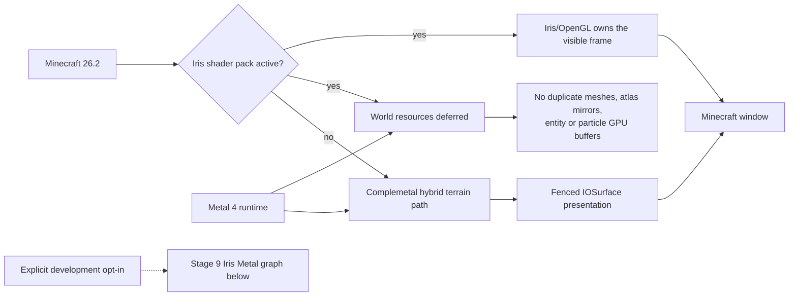
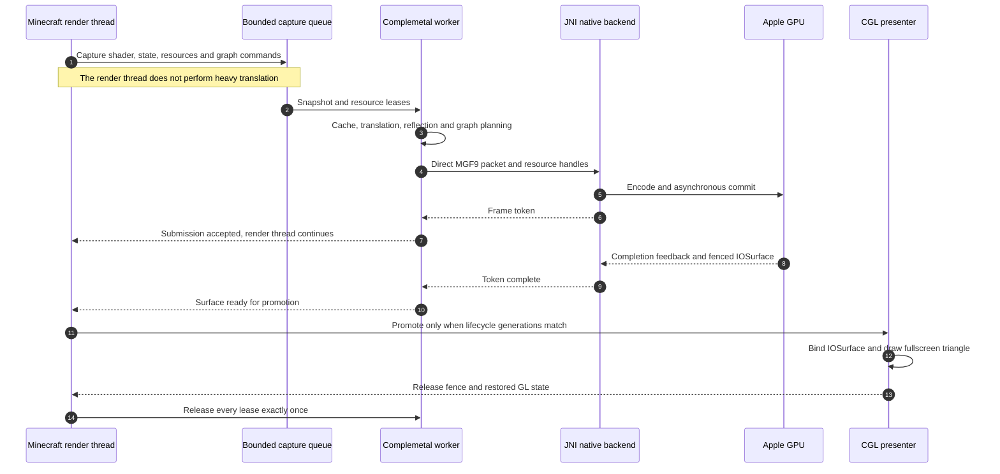
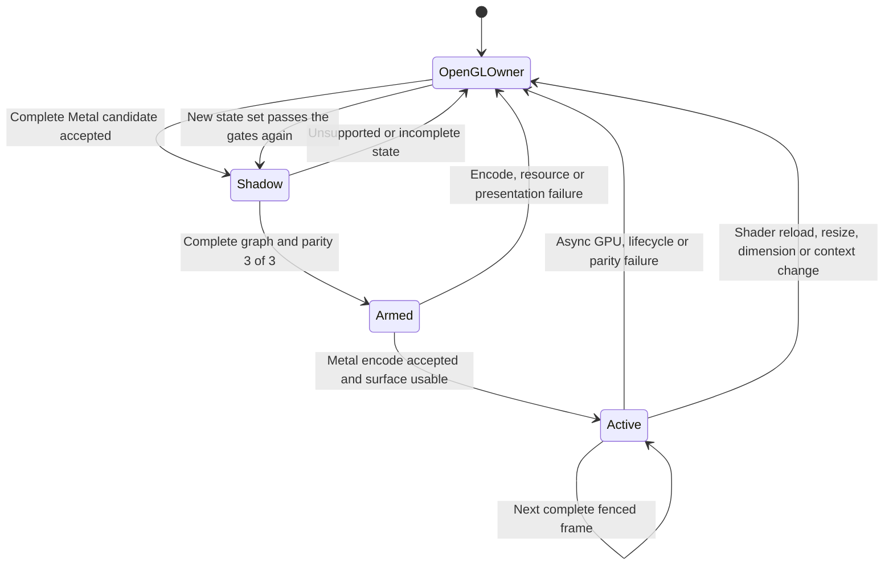

# Complemetal: architecture graphs

**English** | [Русский](ARCHITECTURE_GRAPH_RU.md)

This document is the compact visual map of Complemetal `0.4.1+mc26.2`.
The full explanation of every boundary is available in
[`TECHNICAL_ARCHITECTURE.md`](TECHNICAL_ARCHITECTURE.md).

## Stable 0.4.1 runtime path

The complete graph below documents the implemented experimental Stage 9
pipeline. Stable `0.4.1` does not enter it automatically and never suppresses
Iris/OpenGL draws merely because the machine or JAR version is eligible.

## Experimental complete Iris shader-frame path

```mermaid
flowchart TB
  subgraph Inputs["Minecraft and Iris inputs"]
    Pack["Shader pack"]
    Minecraft["Minecraft Java 26.2<br/>GLFW and OpenGL window"]
    Sodium["Sodium vertex ABI"]
    Iris["Iris transforms<br/>directives, macros, generated uniforms"]
    Pack --> Iris
    Minecraft --> Iris
    Sodium --> Iris
  end

  subgraph Capture["Final-state capture"]
    FinalGLSL["Final linked GLSL<br/>vertex, fragment, compute"]
    GLState["Complete GL pipeline state<br/>vertex, targets, blend, depth, stencil, raster"]
    Resources["Resource generations and ranges<br/>textures, samplers, buffers, UBO, SSBO"]
    Commands["Iris graph commands<br/>passes, draws, dispatches, transfers"]
    Queue["Bounded capture queue<br/>leases and backpressure"]
    Iris --> FinalGLSL
    Iris --> GLState
    Iris --> Resources
    Iris --> Commands
    FinalGLSL --> Queue
    GLState --> Queue
    Resources --> Queue
    Commands --> Queue
  end

  subgraph Compile["Worker: shader and pipeline compilation"]
    ShaderKey["Content-addressed shader key"]
    ShaderCache{"Validated cache hit?"}
    Shaderc["shaderc<br/>GLSL to SPIR-V with OpenGL semantics"]
    Reflect["SPIRV-Cross reflection<br/>resource ABI"]
    MSL["SPIRV-Cross MSL"]
    AppleCompiler{"Apple MTLLibrary validation<br/>correct main0 and stage type?"}
    PipelineMap{"Is the complete state<br/>supported?"}
    PipelineKey["Shader, state and ABI<br/>Metal pipeline key"]
    Archive{"GPU, OS and compiler-qualified<br/>MTL4 archive hit?"}
    Pipeline["MTL4 render or compute pipeline"]
    Queue --> ShaderKey
    ShaderKey --> ShaderCache
    ShaderCache -- "no" --> Shaderc
    Shaderc --> Reflect
    Reflect --> MSL
    MSL --> AppleCompiler
    AppleCompiler -- "yes" --> PipelineMap
    ShaderCache -- "yes" --> PipelineMap
    GLState --> PipelineMap
    PipelineMap -- "yes" --> PipelineKey
    PipelineKey --> Archive
    Archive -- "no" --> Pipeline
    Archive -- "yes" --> Pipeline
    Pipeline --> ArchiveWrite["Atomic archive update"]
  end

  subgraph Runtime["Worker: runtime resources and render graph"]
    Bind{"Are all bindings, generations<br/>and byte ranges proven?"}
    Resident["Persistent Metal resources<br/>resident buffers, textures, IOSurfaces"]
    Graph["IrisRenderGraph<br/>SHADOW, GEOMETRY, DEFERRED, COMPOSITE, FINAL"]
    Hazards["Dependency planner<br/>RAW, WAR and WAW barriers"]
    Packet["MGF9 frame packet<br/>passes, resources, draws, transfers, barriers"]
    Resources --> Bind
    Reflect --> Bind
    Bind -- "yes" --> Resident
    Commands --> Graph
    Graph --> Hazards
    Pipeline --> Packet
    Resident --> Packet
    Hazards --> Packet
  end

  subgraph Native["JNI and Metal 4 execution"]
    Decode{"Native schema, bounds<br/>and handle validation"}
    Encode["MTL4 command encoding<br/>allocator, residency set, passes and barriers"]
    Commit["Asynchronous commit<br/>MTL4CommitFeedback and frame token"]
    FinalBGRA["GPU final conversion<br/>BGRA IOSurface"]
    Fence["Completion and Metal fence"]
    Packet --> Decode
    Decode -- "yes" --> Encode
    Encode --> Commit
    Commit --> FinalBGRA
    FinalBGRA --> Fence
  end

  subgraph Correctness["Correctness and frame ownership"]
    Pair["Paired Iris/OpenGL FINAL"]
    Parity{"Three consecutive exact-parity frames?"}
    Arm["Ownership ARMED"]
    Usable{"Is the surface complete,<br/>fenced and bindable?"}
    Active["Ownership ACTIVE<br/>paired GL draws may be suppressed"]
    Iris --> Pair
    Fence --> Parity
    Pair --> Parity
    Parity -- "yes" --> Arm
    Arm --> Usable
    Usable -- "yes" --> Active
  end

  subgraph Present["Presentation into the Minecraft window"]
    Promote["Promote a lifecycle-valid surface"]
    CGL["CGLTexImageIOSurface2D<br/>triple-buffered rectangle texture"]
    Fullscreen["Short GPU-only fullscreen triangle<br/>with GL-state save and restore"]
    Window["Minecraft GLFW window"]
    Active --> Promote
    Promote --> CGL
    CGL --> Fullscreen
    Fullscreen --> Window
  end

  subgraph Fallback["Fail-open path"]
    Reason["Reason code, counter and blocker"]
    OpenGL["Iris/OpenGL or Minecraft<br/>remains the visible owner"]
    Reason --> OpenGL
    OpenGL --> Window
  end

  AppleCompiler -- "no" --> Reason
  PipelineMap -- "no" --> Reason
  Bind -- "no" --> Reason
  Decode -- "no" --> Reason
  Parity -- "no" --> Reason
  Usable -- "no" --> Reason
  Commit -. "GPU error, timeout or stale token" .-> Reason
  Lifecycle["Resize, shader reload, dimension,<br/>display or context generation"] -. "invalidate" .-> Reason
  Lifecycle -. "presentation reset" .-> Promote
```

The key boundary is that SPIR-V, generated MSL, or even a compiled MTL4
pipeline does not make a frame Metal-owned. Visible ownership begins only
after complete graph execution, parity validation, and delivery of a
lifecycle-valid IOSurface.

## Threads and frame lifetime

## Fail-open and cutover lifecycle

`OpenGLOwner` is the safe normal state, not a crash mode. If Complemetal cannot
prove a particular variant correct, it does not suppress the matching OpenGL
command.
