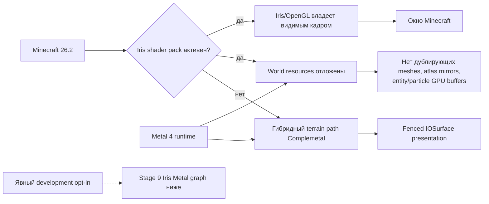
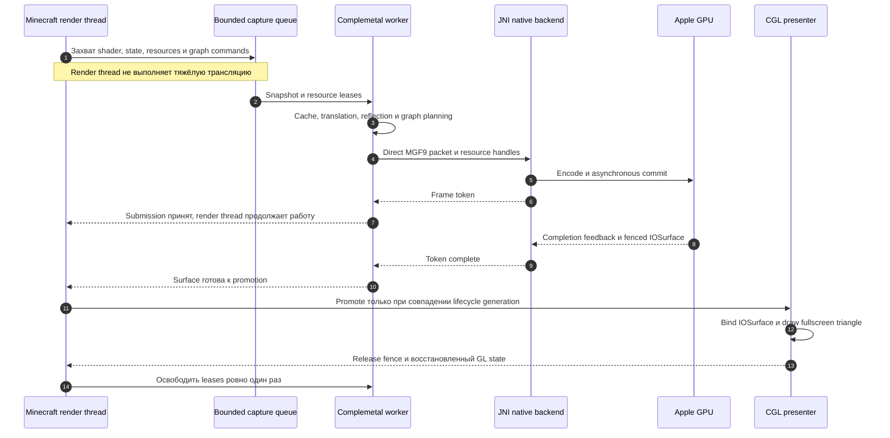
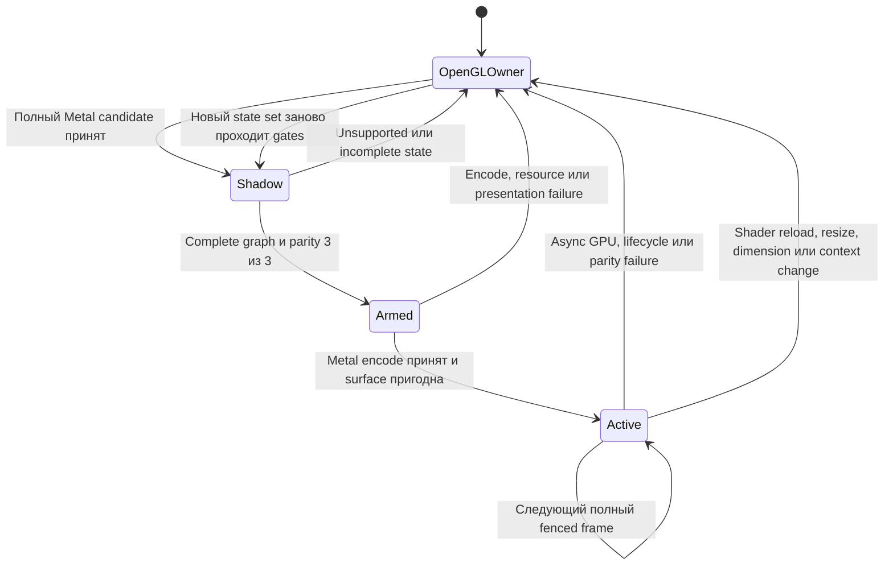

# Complemetal: граф работы проекта

[English](ARCHITECTURE_GRAPH.md) | **Русский**

Этот документ — компактная визуальная карта Complemetal `0.4.1+mc26.2`.
Подробное объяснение каждой границы находится в
[`TECHNICAL_ARCHITECTURE_RU.md`](TECHNICAL_ARCHITECTURE_RU.md).

## Стабильный runtime path 0.4.1

Полный граф ниже документирует реализованный экспериментальный Stage 9
pipeline. Стабильный `0.4.1` не входит в него автоматически и не подавляет
Iris/OpenGL draws только из-за подходящего железа или версии JAR.

## Экспериментальный полный путь Iris shader frame

```mermaid
flowchart TB
  subgraph Inputs["Входы Minecraft и Iris"]
    Pack["Shader pack"]
    Minecraft["Minecraft Java 26.2<br/>GLFW и OpenGL window"]
    Sodium["Sodium vertex ABI"]
    Iris["Iris transforms<br/>directives, macros, generated uniforms"]
    Pack --> Iris
    Minecraft --> Iris
    Sodium --> Iris
  end

  subgraph Capture["Захват финального состояния"]
    FinalGLSL["Финальный linked GLSL<br/>vertex, fragment, compute"]
    GLState["Полный GL pipeline state<br/>vertex, targets, blend, depth, stencil, raster"]
    Resources["Resource generations и ranges<br/>textures, samplers, buffers, UBO, SSBO"]
    Commands["Iris graph commands<br/>passes, draws, dispatches, transfers"]
    Queue["Bounded capture queue<br/>leases и backpressure"]
    Iris --> FinalGLSL
    Iris --> GLState
    Iris --> Resources
    Iris --> Commands
    FinalGLSL --> Queue
    GLState --> Queue
    Resources --> Queue
    Commands --> Queue
  end

  subgraph Compile["Worker: shader и pipeline compilation"]
    ShaderKey["Content-addressed shader key"]
    ShaderCache{"Проверенный cache hit?"}
    Shaderc["shaderc<br/>GLSL to SPIR-V с OpenGL semantics"]
    Reflect["SPIRV-Cross reflection<br/>resource ABI"]
    MSL["SPIRV-Cross MSL"]
    AppleCompiler{"Apple MTLLibrary validation<br/>main0 и stage type корректны?"}
    PipelineMap{"Полный state<br/>поддерживается?"}
    PipelineKey["Shader + state + ABI<br/>Metal pipeline key"]
    Archive{"GPU, OS и compiler-qualified<br/>MTL4 archive hit?"}
    Pipeline["MTL4 render или compute pipeline"]
    Queue --> ShaderKey
    ShaderKey --> ShaderCache
    ShaderCache -- "нет" --> Shaderc
    Shaderc --> Reflect
    Reflect --> MSL
    MSL --> AppleCompiler
    AppleCompiler -- "да" --> PipelineMap
    ShaderCache -- "да" --> PipelineMap
    GLState --> PipelineMap
    PipelineMap -- "да" --> PipelineKey
    PipelineKey --> Archive
    Archive -- "нет" --> Pipeline
    Archive -- "да" --> Pipeline
    Pipeline --> ArchiveWrite["Atomic archive update"]
  end

  subgraph Runtime["Worker: runtime resources и render graph"]
    Bind{"Все bindings, generations<br/>и byte ranges доказаны?"}
    Resident["Persistent Metal resources<br/>resident buffers, textures, IOSurfaces"]
    Graph["IrisRenderGraph<br/>SHADOW, GEOMETRY, DEFERRED, COMPOSITE, FINAL"]
    Hazards["Dependency planner<br/>RAW, WAR и WAW barriers"]
    Packet["MGF9 frame packet<br/>passes, resources, draws, transfers, barriers"]
    Resources --> Bind
    Reflect --> Bind
    Bind -- "да" --> Resident
    Commands --> Graph
    Graph --> Hazards
    Pipeline --> Packet
    Resident --> Packet
    Hazards --> Packet
  end

  subgraph Native["JNI и Metal 4 execution"]
    Decode{"Native schema, bounds<br/>и handle validation"}
    Encode["MTL4 command encoding<br/>allocator, residency set, passes и barriers"]
    Commit["Асинхронный commit<br/>MTL4CommitFeedback и frame token"]
    FinalBGRA["GPU final conversion<br/>BGRA IOSurface"]
    Fence["Completion и Metal fence"]
    Packet --> Decode
    Decode -- "да" --> Encode
    Encode --> Commit
    Commit --> FinalBGRA
    FinalBGRA --> Fence
  end

  subgraph Correctness["Корректность и владение кадром"]
    Pair["Парный Iris/OpenGL FINAL"]
    Parity{"Три последовательных exact parity frames?"}
    Arm["Ownership ARMED"]
    Usable{"Surface завершена,<br/>fenced и bindable?"}
    Active["Ownership ACTIVE<br/>парные GL draws могут подавляться"]
    Iris --> Pair
    Fence --> Parity
    Pair --> Parity
    Parity -- "да" --> Arm
    Arm --> Usable
    Usable -- "да" --> Active
  end

  subgraph Present["Presentation в окно Minecraft"]
    Promote["Promotion lifecycle-valid surface"]
    CGL["CGLTexImageIOSurface2D<br/>triple-buffered rectangle texture"]
    Fullscreen["Короткий GPU-only fullscreen triangle<br/>с сохранением и восстановлением GL state"]
    Window["Minecraft GLFW window"]
    Active --> Promote
    Promote --> CGL
    CGL --> Fullscreen
    Fullscreen --> Window
  end

  subgraph Fallback["Fail-open путь"]
    Reason["Reason code, counter и blocker"]
    OpenGL["Iris/OpenGL или Minecraft<br/>остаётся видимым владельцем"]
    Reason --> OpenGL
    OpenGL --> Window
  end

  AppleCompiler -- "нет" --> Reason
  PipelineMap -- "нет" --> Reason
  Bind -- "нет" --> Reason
  Decode -- "нет" --> Reason
  Parity -- "нет" --> Reason
  Usable -- "нет" --> Reason
  Commit -. "GPU error, timeout или stale token" .-> Reason
  Lifecycle["Resize, shader reload, dimension,<br/>display или context generation"] -. "invalidate" .-> Reason
  Lifecycle -. "presentation reset" .-> Promote
```

Ключевая граница: наличие SPIR-V, MSL или даже созданного MTL4 pipeline само
по себе не делает кадр Metal-кадром. Видимое владение включается только после
полного graph execution, проверки паритета и получения lifecycle-valid
IOSurface.

## Потоки и время жизни кадра

## Fail-open и cutover lifecycle

`OpenGLOwner` — безопасное нормальное состояние, а не аварийный режим. Если
Complemetal не может доказать корректность конкретного варианта, он не
подавляет соответствующую OpenGL-команду.
