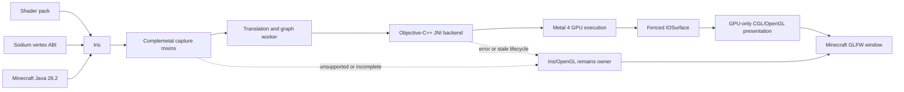
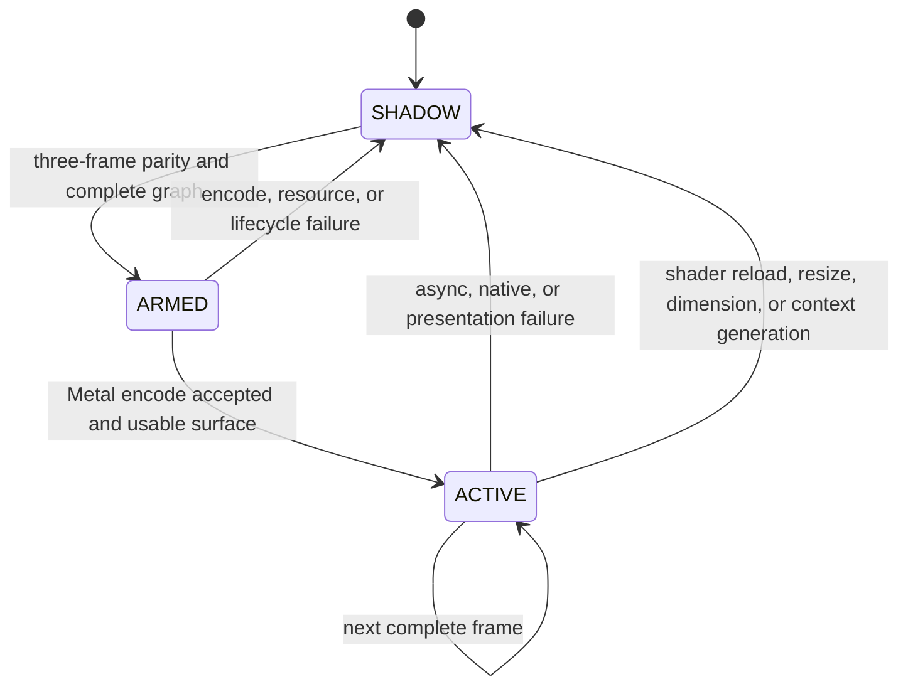

# Complemetal: complete technical architecture

**English** | [Русский](TECHNICAL_ARCHITECTURE_RU.md)

- Document version: 1.0
- Target mod version: `0.4.0+mc26.2`
- Minecraft: Java Edition 26.2
- Platform: Fabric, Java 25, Apple Silicon, macOS 26+, Metal 4

## 1. Project summary

Complemetal is a hybrid client renderer for Minecraft Java on Apple Silicon.
Its main path does not translate arbitrary OpenGL calls into Metal one by one.
Instead, it observes the program already prepared by Iris, captures the final
shaders, complete pipeline state, resources, and pass graph, then replays a
**validated Iris frame as a whole** through Metal 4.

The main path is:

```text
final GLSL after Iris transformations
  -> SPIR-V with OpenGL semantics
  -> reflected ABI and MSL
  -> MTLLibrary validation
  -> Metal pipeline and persistent archive
  -> Metal render graph
  -> comparison with Iris/OpenGL
  -> graph ownership and paired OpenGL-command suppression
  -> IOSurface
  -> short GPU-only GL/CGL presentation pass into the Minecraft window
```

This means:

- heavy shader-pack phases SHADOW, GEOMETRY, DEFERRED, COMPOSITE, and FINAL
  can execute natively through Metal 4;
- Minecraft still owns the GLFW/OpenGL window, so the final image crosses an
  IOSurface and a short OpenGL/CGL fullscreen pass;
- the CPU does not copy the completed image between Metal and OpenGL;
- the Minecraft UI and known unsupported work remain on their stock path;
- if any requirement is incomplete, Complemetal does not guess and leaves the
  Iris/OpenGL result visible.

Complemetal is a continuation and fork of
[MetalRender](https://github.com/webblepebbles/MetalRender) by pebbles_boon /
webblepebbles. See [`LINEAGE.md`](LINEAGE.md) for attribution and the history
boundary. A dedicated visual map is available in
[`ARCHITECTURE_GRAPH.md`](ARCHITECTURE_GRAPH.md).

## 2. Non-goals and claim boundaries

The implemented path must be distinguished from broader claims:

- it is not a universal OpenGL-to-Metal translator for every mod;
- it does not replace the GLFW/OpenGL window with a direct `CAMetalLayer`;
- it is not native Metal rendering for every Minecraft UI and renderer path;
- it does not automatically make every shader pack compatible;
- it does not promise a universal FPS increase;
- the presence of MTL4 API objects does not prove that the visible frame is
  Metal-owned;
- 200 Hz operation is not a guarantee of VSync-synchronised native Metal
  scanout because the current final image still crosses the IOSurface-to-CGL
  boundary.

## 3. Public identity and preserved compatibility boundaries

Version `0.4.0` changes the public product identity to Complemetal:

| Boundary | New value | Compatibility behavior |
| --- | --- | --- |
| Fabric mod id | `complemetal` | metadata `provides: ["metalrender"]` |
| JAR name | `complemetal-0.4.0+mc26.2.jar` | existing JARs are not modified |
| Resources | `assets/complemetal/` | the old namespace is not needed inside the new JAR |
| Commands | `/complemetal`, `/cm` | `/metalrender`, `/mr` remain aliases |
| Config | `config/complemetal.json` | legacy `metalrender.json` is imported on first run |
| JVM properties | `metalrender.*` | intentionally preserved as a stable internal boundary |
| Java packages | `com.pebbles_boon.metalrender.*` | preserved for binary compatibility |
| JNI symbols | `Java_com_pebbles_1boon_metalrender_*` | preserved and checked as 155 pairs |
| Native library | `libmetalrender.dylib` | preserved to avoid breaking extraction and ABI |
| Cache formats | `metalrender-iris-*` / `iris-metal-v1` | preserved for warm-cache compatibility |

The rebrand changes the user-facing identity without introducing unnecessary
risk at the Java/JNI/native boundaries that carry most of the renderer's
compatibility cost.

## 4. System context



There is one process boundary: Java, JNI, Objective-C++, and GPU submission all
run inside the Minecraft process. The project has no network service,
telemetry backend, or cloud shader compiler.

## 5. Complete path of one shader-pack frame

### 5.1. Iris builds the real program

Iris processes the shader pack first. It applies pack directives,
compatibility transformations, generated uniforms, macros, and Sodium vertex
conventions. A source file taken directly from the ZIP is therefore
insufficient: it may differ from the GLSL that Iris actually linked in
OpenGL.

`IrisProgramBuilderMixin`, `IrisShaderCreatorMixin`, and related accessor/mixin
points pass the final linked stages into `IrisShaderCapture`.
`IrisFinalShaderProgram` holds a bounded snapshot of vertex, fragment, and
compute code together with final vertex inputs.

### 5.2. Capture keeps expensive work off the render thread

`IrisShaderCaptureQueue` limits both queue length and retained bytes. The
render thread only validates the snapshot shape, reserves bounded capacity,
and transfers the required state. Hashing, cache lookup, and translation run
on the daemon worker `Complemetal-Iris-Translator`, owned by
`IrisTranslationCoordinator`.

A worker exception increments diagnostics and becomes a blocker/reason code.
It must not escape and terminate Minecraft.

### 5.3. GLSL to SPIR-V

`LwjglShadercSpvcBackend` invokes shaderc in-process. Compilation uses OpenGL
semantics because the input program was produced for Iris/OpenGL.
`IrisShaderCacheKey` includes final stage contents, the translation profile,
and relevant ABI properties.

### 5.4. SPIR-V reflection and MSL generation

SPIRV-Cross has two connected responsibilities:

1. reflect uniforms, samplers, sampled and storage images, texture buffers,
   UBOs, SSBOs, locations, array/range data, and access qualifiers;
2. generate MSL and the Metal argument-table layout.

The central models are `IrisSpirvResourceLayout`,
`IrisProgramResourceLayout`, `IrisMslArgumentLayout`, and their
content-addressed keys. `IrisMslArgumentLayoutReader` connects reflected
SPIR-V resources to concrete Metal argument-table slots.

### 5.5. Apple compiler validation

`NativeIrisMslLibraryValidator` sends generated MSL through `NativeBridge` to
the native backend. Apple must create the library, resolve `main0`, and return
the expected function type. Generated text alone is not success; this compiler
check must pass.

### 5.6. Complete pipeline state

Mixins around Iris/OpenGL observe:

- vertex attribute locations, formats, offsets, strides, and step rates;
- topology and primitive expansion;
- color/depth/stencil attachment formats and sample count;
- blend equations and factors, write masks, and alpha-to-coverage;
- depth/stencil comparison, operations, references, and masks;
- cull mode, front face, fill mode, and depth bias;
- specialisation and function constants;
- framebuffer routing and draw buffers.

`IrisGlStateTracker` produces an `IrisGlStateSnapshot`.
`IrisPipelineStateCapture` combines the snapshot with the program and dynamic
resources. `IrisPipelineStateMapper` either creates a strict
`IrisPipelineState` or returns an unsupported reason. Incomplete state never
receives a pipeline key.

### 5.7. Pipeline key and persistent archive

`IrisMetalPipelineDescriptorEncoder` serialises the exact pipeline descriptor.
`IrisMetalPipelineKey` adds shader/profile identity and complete render state.
`NativeIrisMetalPipelineCompiler` creates an MTL4 render or compute pipeline.

The native backend uses `MTL4Compiler`, `MTL4PipelineDataSetSerializer`, and
`MTL4Archive`. An archive is qualified by shader/state identity, GPU, OS build,
and compiler identity. An incompatible, corrupt, or stale archive is rejected
and rebuilt rather than trusted.

### 5.8. Runtime resources

OpenGL numeric names are not stable identity: GL can delete an object and
reuse the same number. Complemetal trackers therefore attach generation
identity.

- `IrisGlBufferMirror` and `IrisGlBufferReadback` capture bounded vertex,
  index, UBO, and SSBO byte ranges;
- `IrisGlTextureMirror`, `IrisGlTextureGpuHandoff`, and
  `IrisGlTextureReadback` resolve texture images, subresources, and
  generations;
- `IrisGlSamplerMirror` records sampler state;
- `IrisGlVertexArrayTracker` and `IrisVertexInputBindings` construct the exact
  vertex ABI;
- `IrisMetalBufferResidentCache` retains content-addressed Metal buffers;
- compatible dynamic textures use IOSurface/GPU handoff, while a late
  readback is promoted into the resident cache once rather than once per
  packet.

Every large container has a limit, byte accounting, eviction, and diagnostic
counters. If the complete required range cannot be obtained, that candidate is
unsupported.

### 5.9. Iris render graph

`IrisRenderGraphCapture` observes frame boundaries and commands across:

- BEGIN;
- SHADOW;
- GEOMETRY;
- DEFERRED;
- COMPOSITE;
- FINAL.

`IrisRenderGraphBuilder` builds `IrisRenderGraph`: nodes, attachments, history
ping-pong, clears, copies/blits, mip generation, draws/dispatches, and
transitions. `IrisRenderExecutionPlan` computes execution order.
`IrisMetalGraphFramePlanner` resolves concrete resources and creates the Metal
plan. Dependencies are classified as:

- RAW — read after write;
- WAR — write after read;
- WAW — write after write.

They become explicit MTL4 barriers. The accepted steady frame contained 13
render passes, 19 draws, and 18 barriers. Those values are observations, not
hard-coded limits.

### 5.10. Frame packet and native execution

`IrisMetalGraphFramePacketEncoder` writes the production MGF9 packet. It
contains dimensions, pipeline handles and keys, render/compute passes,
clears, transfers, draw commands, resource tables, ranges, barriers, and the
presentation target.

`NativeIrisMetalGraphExecutor` passes a direct `ByteBuffer` and native handles
through JNI. The native backend:

1. validates magic, schema, bounds, and handles;
2. creates an allocator and MTL4 command buffer;
3. creates an `MTLResidencySet` for frame resources;
4. encodes passes, argument tables, draws, dispatches, transfers, and barriers;
5. encodes final conversion into a CGL-compatible BGRA IOSurface;
6. commits with `MTL4CommitFeedback`;
7. returns a frame token instead of waiting for the GPU on the render thread.

### 5.11. Asynchronous completion

The graph worker owns the native graph mutex during submission and completion
handling. The render thread must not wait for that mutex when a previous
completed, fenced surface is already available. It presents the last valid
frame and promotes a newer token on a subsequent frame. The first usable
surface cannot be deferred, because OpenGL ownership must never be suppressed
without a visible replacement.

Every captured resource owns a lease. That lease is released exactly once on
success, rejection, backpressure, lifecycle invalidation, or shutdown. Queue
capacity measures unique retained data rather than double-counting repeated
references.

### 5.12. Visual parity

Before ownership can activate, Metal FINAL is compared with its paired
Iris/OpenGL FINAL. `IrisVisualParityCapture` obtains two RGBA8 images and
`IrisVisualParityGate` checks:

- identical dimensions;
- orientation and row order;
- different-pixel ratio;
- RMSE;
- maximum channel delta;
- the required number of consecutive matches.

The production gate requires three consecutive frames. The final `0.3.1`
qualification recorded 3/3, zero different pixels, RMSE 0, and maximum delta
0. Parity applies to the observed state set. A new unknown variant cannot
inherit another variant's result.

### 5.13. Ownership and OpenGL suppression

`IrisSelectiveCutoverGate` follows this lifecycle:



Each paired draw, clear, or transfer must first have an eligible Metal
candidate. The OpenGL command is suppressed only after an accepted Metal
encode or an already completed full-frame ownership arm. If the worker finds
an error after suppression, the in-flight frame becomes incomplete, ownership
is reset, and the next frame returns to the safe branch.

### 5.14. IOSurface presentation

Metal writes the final BGRA result into an IOSurface. Native completion makes
the surface eligible for promotion. `IrisMetalCutoverPresenter` maintains three
OpenGL rectangle textures bound through `CGLTexImageIOSurface2D`.

The presentation pass:

- saves the caller's GL state;
- disables blend/depth/stencil/cull/scissor and interfering state;
- selects the exact Iris framebuffer;
- draws a fullscreen triangle;
- reads `sampler2DRect` in framebuffer coordinates;
- performs exact `.bgra` channel mapping;
- places a release fence;
- restores the original GL state.

In full-graph steady state there is no CPU pixel copy and no `glFinish`.
Previous surfaces are reused only after their fences. During reset, the CGL
texture binding is destroyed before the IOSurface returns to the Metal pool,
closing the race that produced black or purple tiles.

## 6. Fail-open as the primary invariant

Complemetal prefers to skip a Metal optimisation instead of showing an
undefined frame. A candidate is rejected when any of the following is unknown
or contradictory:

- shader stage or entry function;
- vertex format, location, stride, or range;
- attachment format, size, sample count, or subresource;
- blend, depth, stencil, raster, or topology state;
- specialisation constant;
- uniform, sampler, texture, image, UBO, or SSBO binding;
- buffer range, generation, or contents;
- graph dependency, initialisation, or history identity;
- pipeline-archive qualification;
- lifecycle generation;
- visual parity;
- a completed and bindable presentation surface.

Geometry shaders are always unsupported. Native entity/particle replacement,
mesh shaders, Hi-Z, and earlier experimental paths are outside the Stage 9
release contract and cannot become visible automatically.

## 7. Threads and ownership

| Context | Responsibility |
| --- | --- |
| Minecraft render thread | Observe final GL/Iris state, bounded capture, pair commands, promote/present, and restore GL state |
| Complemetal translation/graph worker | Hash, validate caches, translate, reflect, plan graph, submit native work, and process completion |
| Native serialised graph section | Mutate MTL4 compiler/archive state, manage residency, validate packets, and encode commands |
| Apple GPU | Execute shaders, transfers, barriers, final BGRA conversion, and produce IOSurfaces |
| Client tick/display observer | Track GLFW topology, scale, framebuffer, refresh, fullscreen, visibility, and wake-like gaps |

Important lifetime identities are:

- shader/program digest;
- OpenGL resource generation;
- graph/context generation;
- display lifecycle generation;
- native frame token;
- IOSurface slot and GL fence.

A stale token cannot be promoted after a lifecycle-generation change. This
prevents a frame from an old size, monitor, dimension, or shader graph from
appearing in the new state.

## 8. Display lifecycle and high refresh

`DisplayLifecycleTracker` polls bounded GLFW state and detects:

- a changed window handle;
- monitor topology and active monitor;
- window and framebuffer dimensions;
- content scale and Retina backing;
- refresh rate;
- fullscreen mode;
- visible or iconified state;
- a client-tick gap of at least five seconds as a probable wake boundary.

`DisplayPresentationTracker` measures actual Minecraft `GlSurface.present()`
calls rather than an internal Metal timer.

A display transition performs a presentation-only reset:

- ownership is temporarily disabled;
- pending IOSurface binding is reset;
- cached GLFW framebuffer dimensions are synchronised with reality;
- translation caches, pipelines, persistent graph attachments, resident
  inputs, and valid in-flight graph structures are retained;
- ownership returns only after a newly completed surface.

An early development candidate passed 2x Retina and migration between the
built-in display and a VX24G10 at 200 Hz. Six hundred samples measured 181.52
and 198.64 `present()` calls per second in VSync-off software-paced mode with
no stalls of at least 100 ms. This proves that the tested path had no hard
60 Hz cap. It does not prove VSync-synchronised native 200 Hz scanout for the
final release JAR.

## 9. Caches and shader-pack privacy

The default translation cache is:

```text
<gameDir>/.cache/metalrender/iris-metal-v1/<sha-prefix>/<sha256>/
```

It stores:

- `manifest.properties`;
- generated `.spv` files;
- generated `.metal` files;
- a completion marker;
- pipeline and archive artifacts.

Original shader-pack GLSL is not persisted. The manifest records
`source.original_glsl_persisted=false`. The cache reader revalidates path,
size, SHA-256, file type, UTF-8/MSL marker, SPIR-V magic, schema, and completion
marker. Writes are atomic and the completion marker is created last.

Current translation-cache limits are:

- 512 entries;
- 1 GiB total;
- 64 MiB per generated stage artifact;
- 16 MiB of MSL per library-validation operation.

The native payload, `libmetalrender.dylib` and `shaders.metallib`, is extracted
into a versioned cache under `~/Library/Caches/Complemetal/native/` with a
SHA-256 path component and control files. Contents and Metal-library magic are
checked before loading.

## 10. Configuration and activation

The full Iris-to-Metal path becomes a production default only when:

1. code is loaded from a packaged stable version matching `x.y.z+mc26.2`;
2. Fabric is not in a development environment;
3. the OS is macOS 26 or newer;
4. the architecture is `arm64` or `aarch64`;
5. the native Metal 4 probe creates, encodes, commits, and completes a real
   MTL4 command buffer.

Translation, compiler, pipeline, resource, graph, parity, and presentation
gates still have to pass at runtime.

Primary `complemetal.json` settings include:

- `enableMetalRendering`;
- `enableMetal4` and strict `requireMetal4`;
- `autoTargetFrameRate` and `targetFrameRate`, validated from 30 to 1000;
- `enableTripleBuffering`;
- `maxMemoryMB`, validated from 512 to 2048;
- quality, culling, and simulation-distance settings;
- debug overlay and a one-run deep-debug marker.

Experimental entity/particle replacement is release-locked. Mesh shaders,
Hi-Z, and fast terrain require explicit development JVM properties.

The emergency switch is:

```text
-Dmetalrender.irisMetal.enabled=false
```

The old prefix is intentionally preserved and documented as an internal
compatibility API.

## 11. Native ABI

`NativeBridge.java` and `metalrender.mm` define a JNI ABI with 155 native
methods. `scripts/check_jni_parity.sh` generates a header with `javac -h`,
extracts exports with `nm`, and compares both sets:

- a Java declaration without a native export is an error;
- an orphan native export without a Java declaration is an error.

Objective-C++ is built as a thin arm64 dylib with a macOS 14 minimum deployment
target. MTL4 objects are used only inside macOS 26 availability guards. Metal
3 fallback remains available when Metal 4 is not requested or its probe fails.

Exact backend names are:

| Name | Meaning |
| --- | --- |
| `METAL4` | MTL4 runtime and validated Iris full graph are actually active |
| `METAL4_RUNTIME_VERIFIED_METAL3_RENDER` | MTL4 probe passed but the active compatibility stream still renders through Metal 3 |
| `METAL3` | Metal 4 was explicitly disabled |
| `METAL3_FALLBACK_NO_METAL4` | Metal 4 was requested but the API is unavailable |
| `METAL3_FALLBACK_METAL4_PROBE_PENDING` | probe has not completed |
| `METAL3_FALLBACK_METAL4_PROBE_FAILED` | real MTL4 probe failed |
| `UNAVAILABLE` | native initialisation is incomplete and Minecraft remains on its stock path |

## 12. Nine development stages

| Stage | Result | Primary exit gate |
| ---: | --- | --- |
| 0 | Minecraft 26.2 foundation and native lifecycle | Packaged Fabric JAR and Metal 3 fallback |
| 1 | Final Iris GLSL to SPIR-V to MSL cache | 231 programs and 462 stages, cold/warm integrity |
| 2 | Apple compiler validation | 462/462, correct `main0`, no leaked live libraries |
| 3 | Complete pipeline state | Vertex ABI, targets, raster/blend/depth/stencil, and specialisation are keyed |
| 4 | Resource reflection and binding | 6,248 declarations; a missing binding rejects the candidate |
| 5 | Iris render graph | Every shader phase, history edge, transfer, and hazard is represented |
| 6 | MTL4 pipeline/archive | Device/OS/compiler-qualified cold compile and warm reuse |
| 7 | Offscreen execution and parity | Full replay and exact three-frame FINAL comparison |
| 8 | Selective cutover | Fenced IOSurface, paired GL cancellation, and fail-open recovery |
| 9 | Full graph ownership and performance | Persistent resources, asynchronous frame submission, exact-JAR and matched A/B gates |

Stage 9 means ownership of the supported Iris shader graph, not ownership of
the complete Minecraft frame from UI to window scanout.

## 13. Git history

| Date | Commit | Change |
| --- | --- | --- |
| 2026-07-29 | `5f9997b` | Imported the MetalRender base into a standalone history |
| 2026-07-29 | `cd1b299` | Ported to Minecraft 26.2 and added the Metal 4 foundation |
| 2026-07-30 | `c3eec8d` | Added the Iris GLSL-to-Metal cache foundation |
| 2026-07-31 | `f96dd75` | Stabilised MetalRender 0.2.0 |
| 2026-07-31 | `05d1fa4` | Corrected the honest Iris compatibility boundary |
| 2026-07-31 | `da817e9` | Validated generated MSL with the Apple compiler |
| 2026-08-19 | `79af375` | Captured complete Iris pipeline state and SPIR-V reflection |
| 2026-08-20 | `d29bdbe` | Added runtime resource reflection and binding |
| 2026-08-20 | `4d175dc` | Added render-graph and hazard capture |
| 2026-08-24 | `e5e4ce3` | Completed Stage 9 MTL4 graph, parity, ownership, and performance QA |
| 2026-08-25 | `3da8065` | Added display lifecycle and high-refresh QA |
| 2026-08-25 | `52ac697` | Synchronised the real Retina framebuffer |
| 2026-08-25 | `be3a8d8` | Published the stable `0.3.1` exact-JAR baseline |
| 2026-08-26 | `v0.4.0+mc26.2` | Rebranded publicly as Complemetal and added migration, attribution, and release packaging |

The standalone import did not preserve an exact upstream base hash. The
documentation therefore records the provable local boundary `5f9997b`
instead of inventing an upstream commit.

## 14. Release verification

### 14.1. Static and unit checks

```bash
./gradlew --no-daemon test check
```

The current code base contains approximately:

- 50,512 lines of client Java;
- 15,926 lines in the Objective-C++ native backend;
- 5,451 lines in the coordinator;
- 3,482 lines in the exact-JAR harness;
- 72 unit-test classes and 307 `@Test` methods;
- 155 checked JNI declaration/export pairs.

### 14.2. Release payload

```bash
DEVELOPER_DIR=/Applications/Xcode.app/Contents/Developer \
  ./gradlew --no-daemon clean test check build releaseCheck
```

`releaseCheck` rebuilds:

- an ad-hoc signed arm64 `libmetalrender.dylib` without sanitizer runtime;
- offline `shaders.metallib` with `MTLB` magic;
- a reproducible-order JAR;
- manifest and Fabric metadata;
- Java 25 mixin compatibility;
- complete JNI parity.

### 14.3. Exact packaged-JAR QA

`scripts/exact_jar_qa.py` creates an isolated production Fabric profile and
proves that the code was loaded from the requested JAR and SHA-256 rather than
from a Gradle source set.

The Metal 4 cold/warm matrix checks:

- packaged-stable automatic activation;
- shader pack on, off, and on again;
- Overworld to Nether to End to Overworld;
- translation, compiler, pipeline archive, and graph resources;
- exact visual parity;
- OpenGL suppression only while ownership is active;
- resize, fullscreen, window restore, and surface suspend/restore;
- zero GPU, timeout, IOSurface, or ownership faults;
- clean process exit.

The forced Metal 3 cold/warm matrix requires the inverse:

- zero MTL4 Iris draws;
- zero Metal graph presentations;
- zero OpenGL suppression;
- Iris/OpenGL remains the visible owner;
- the same dimension, shader-toggle, and lifecycle scenarios finish normally.

### 14.4. Performance gate

Matched A/B testing uses the same world, camera, time/weather, resolution,
shader pack, distances, and warm cache. Each side records at least 600
samples. The release gate requires:

- at least 5% better CPU p50 and p95;
- no more than 5% regression in p99 and GPU tails;
- no stutter regression;
- a reverse launch-order repeat.

On an M4 Pro at 1280x720 with Complementary Reimagined r5.8.1, the measured
frame-time improvements were:

- CPU p50: 42.6–44.8%;
- CPU p95: 27.1–37.4%;
- GPU p95: 10.5–19.5%;
- GPU p99: 11.5–32.5%;
- zero frames at or above 100 ms on every side.

Those values apply to that scene. The `0.4.0` rebrand does not alter the
renderer algorithm and makes no new universal FPS claim without a new matched
run.

## 15. Source map

| Area | Primary files |
| --- | --- |
| Mod lifecycle | `MetalRenderClient`, `MetalRenderConfig`, `MetalRenderHookState` |
| Iris injection | `compat/iris/mixin/*`, `metalrender.iris.mixins.json` |
| Shader capture and translation | `IrisShaderCapture`, `IrisTranslationCoordinator`, `LwjglShadercSpvcBackend` |
| Cache | `IrisShaderCacheKey`, `IrisPipelineCache`, `IrisPipelineCacheLayout` |
| Reflection | `IrisSpirvResourceReflector`, `IrisMslArgumentLayoutReader` |
| Pipeline state | `IrisGlStateTracker`, `IrisPipelineStateCapture`, `IrisPipelineStateMapper` |
| Runtime resources | `IrisGl*Mirror`, `IrisGl*Readback`, `IrisMetalBufferResidentCache` |
| Render graph | `IrisRenderGraphCapture`, `IrisRenderGraphBuilder`, `IrisMetalGraphFramePlanner` |
| Packet ABI | `IrisMetalGraphFramePacketEncoder`, native MGF9 decoder |
| Metal compile and execution | `NativeIrisMetalPipelineCompiler`, `NativeIrisMetalGraphExecutor`, `metalrender.mm` |
| Correctness and cutover | `IrisVisualParityGate`, `IrisSelectiveCutoverGate`, `IrisMetalCutoverPresenter` |
| Display | `DisplayLifecycleTracker`, `DisplayPresentationTracker`, `GlSurfaceMixin` |
| Native ABI | `NativeBridge`, `metalrender.mm`, `check_jni_parity.sh` |
| Exact release QA | `exact_jar_qa.py`, `ExactJarClientGameTest.java`, `verify_release_jar.sh` |

## 16. Observability and diagnostics

`/complemetal status` aggregates counters and blocker summaries across:

- capture, translation, and cache;
- MSL library validation;
- pipeline-state variants;
- reflected and matched resource bindings;
- render-graph nodes, edges, and barriers;
- native graph allocation and execution;
- visual parity;
- ownership mode and invalidations;
- presentations and suppressed OpenGL commands;
- GPU-command errors, feedback errors, timeouts, and unavailable IOSurface
  slots;
- display topology and lifecycle transitions.

The profiler overlay and CSV worker expose frame/load metrics. Exact-JAR
sidecars carry a versioned schema and SHA-256 so the release checklist points
to immutable evidence rather than an informal observation.

## 17. Known limitations

The following are not fully qualified for `0.4.0`:

- geometry-shader packs;
- Intel Macs, Windows, and Linux;
- Minecraft versions other than 26.2;
- arbitrary Iris/Sodium versions outside the stated matrix;
- every shader pack other than the accepted Complementary workload;
- direct `CAMetalLayer` scanout;
- physical sleep/wake on the final JAR SHA;
- physical external-display disconnect/reconnect on the final JAR SHA;
- VSync-synchronised native 200 Hz scanout;
- experimental entity/particle replacement;
- release-ready mesh shaders, Hi-Z, MetalFX, or programmable blending.

Unsupported means that the safe OpenGL/Minecraft branch remains visible. It
does not imply that a crash is acceptable.

## 18. Post-Stage-9 development

The technically justified next steps are:

1. repeat physical Retina, two-display, sleep/wake, and 200 Hz qualification
   against the exact `0.4.0` SHA;
2. expand the shader-pack conformance corpus and reason-code statistics;
3. add reproducible CI for Java, cache, and packet validators plus a separate
   macOS 26 release runner for native and exact-JAR work;
4. investigate direct `CAMetalLayer` only as a separate architecture branch,
   because it requires taking ownership of the Minecraft window;
5. replace legacy texture readbacks with fenced GPU handoff before enabling
   entity/particle replacement;
6. optimise the resident cache and frame packet from new matched profiles
   without weakening parity or fallback gates.

## 19. Final invariant

Complemetal does not call a frame Metal-rendered merely because an MTL4 object
exists or MSL was generated. Visible Metal ownership is declared only when the
same observed program passes the complete chain:

```text
capture
  + translation
  + Apple compile
  + exact pipeline state
  + complete resource binding
  + complete graph and hazards
  + native MTL4 execution
  + three-frame visual parity
  + lifecycle-valid completed IOSurface
  + successful fenced presentation
```

If any term is missing, Iris/OpenGL keeps the visible frame. That fail-open
invariant is the central architecture of Complemetal.
