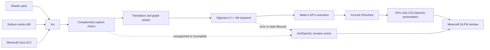
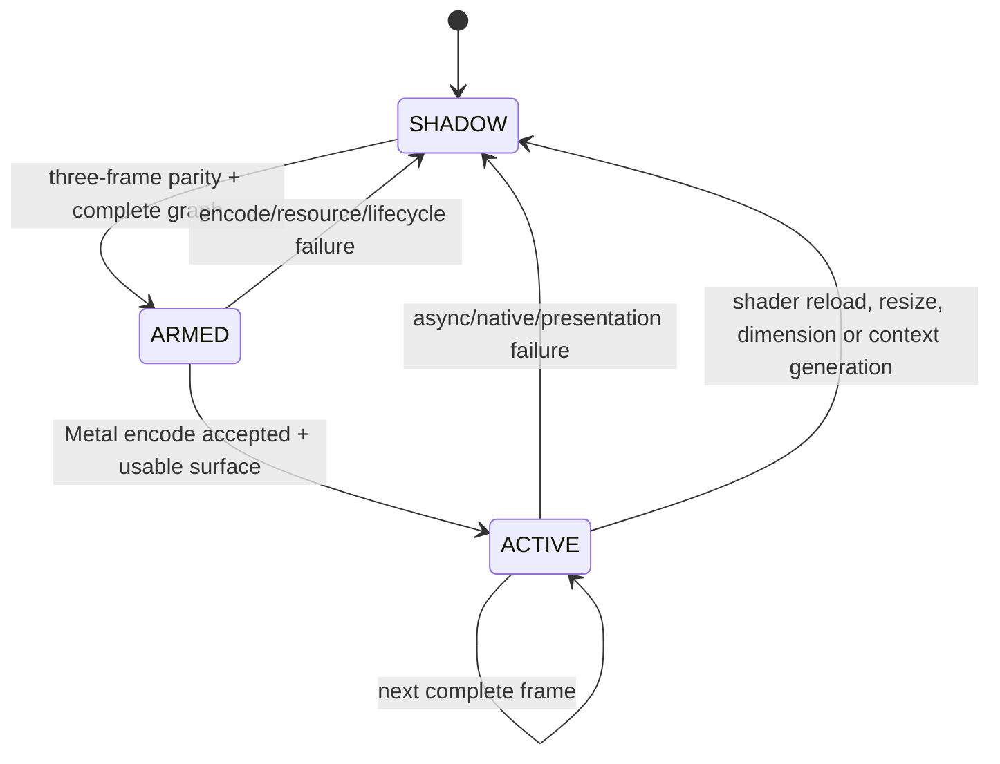

# Complemetal: полная техническая архитектура

[English](TECHNICAL_ARCHITECTURE.md) | **Русский**

- Версия документа: 1.1
- Целевая версия мода: `0.4.1+mc26.2`
- Minecraft: Java Edition 26.2
- Платформа: Fabric, Java 25, Apple Silicon, macOS 26+, Metal 4

## 1. Кратко: что это за проект

Complemetal — клиентский гибридный рендерер для Minecraft Java на Apple
Silicon. Его главная ветка не переводит произвольные вызовы OpenGL в Metal
один за другим. Вместо этого она наблюдает уже подготовленную Iris программу,
захватывает конечные шейдеры, полное состояние пайплайна, ресурсы и граф
проходов, а затем воспроизводит **проверенный кадр Iris целиком** через Metal
4.

Этот абзац описывает реализованную экспериментальную архитектуру Stage 9. В
стабильном профиле `0.4.1` видимый кадр при активном Iris остаётся на
Iris/OpenGL. Translation, draw interception и graph ownership включаются
только явными development-параметрами, а дублирующие Metal-ресурсы мира не
создаются всю Iris-сессию. Эта граница введена после реального теста `0.4.0`,
который выявил render-thread stalls, чёрный кадр после неполного graph capture
и crash при live reload.

Основной путь:

```text
финальный GLSL после преобразований Iris
  -> SPIR-V с OpenGL-семантикой
  -> отражение ABI и MSL
  -> проверка MTLLibrary
  -> Metal pipeline + постоянный архив
  -> Metal render graph
  -> проверка совпадения с Iris/OpenGL
  -> владение графом и подавление парных OpenGL-команд
  -> IOSurface
  -> короткий GPU-only GL/CGL presentation pass в окно Minecraft
```

Это означает:

- тяжёлые shader-pack проходы SHADOW, GEOMETRY, DEFERRED, COMPOSITE и FINAL
  могут исполняться нативно через Metal 4;
- Minecraft по-прежнему владеет GLFW/OpenGL-окном, поэтому финальный кадр
  передаётся через IOSurface и короткий OpenGL/CGL fullscreen-pass;
- CPU не копирует готовый кадр между Metal и OpenGL;
- UI Minecraft и всё заведомо неподдерживаемое остаётся в штатном рендерере;
- при любой неполноте Complemetal не «угадывает», а оставляет Iris/OpenGL
  видимым.

Complemetal — продолжение и форк
[MetalRender](https://github.com/webblepebbles/MetalRender) авторства
pebbles_boon / webblepebbles. Подробная атрибуция и история разделения описаны
в [`LINEAGE.md`](LINEAGE.md), а отдельная визуальная карта полного потока — в
[`ARCHITECTURE_GRAPH_RU.md`](ARCHITECTURE_GRAPH_RU.md).

## 2. Что проект не обещает

Важно отделять реализованный путь от более широких формулировок:

- это не универсальный OpenGL-to-Metal translator для всех модов;
- это не замена GLFW/OpenGL-окна на прямой `CAMetalLayer`;
- это не полная нативная Metal-отрисовка каждого элемента Minecraft;
- это не автоматическая поддержка любого shader pack;
- это не универсальная гарантия прироста FPS;
- доступность MTL4 API сама по себе не означает, что видимый кадр уже рисуется
  через Metal;
- режим 200 Гц не является гарантированным VSync-синхронизированным Metal
  scanout: текущая финальная картинка всё ещё пересекает IOSurface-to-CGL
  границу.

## 3. Публичное имя и сохранённые внутренние границы

В `0.4.0` публичный продукт переименован в Complemetal:

| Граница | Новое значение | Совместимость |
| --- | --- | --- |
| Fabric mod id | `complemetal` | metadata `provides: ["metalrender"]` |
| Имя JAR | `complemetal-0.4.1+mc26.2.jar` | старые JAR не модифицируются |
| Ресурсы | `assets/complemetal/` | старый namespace больше не нужен внутри нового JAR |
| Команды | `/complemetal`, `/cm` | `/metalrender`, `/mr` сохранены |
| Конфиг | `config/complemetal.json` | старый `metalrender.json` импортируется при первом запуске |
| JVM properties | `metalrender.*` | намеренно сохранены стабильными |
| Java packages | `com.pebbles_boon.metalrender.*` | сохранены для бинарной совместимости |
| JNI symbols | `Java_com_pebbles_1boon_metalrender_*` | сохранены; проверяется 155 пар |
| Native library | `libmetalrender.dylib` | сохранена, чтобы не ломать extraction/ABI |
| Cache formats | `metalrender-iris-*` / `iris-metal-v1` | сохранены для warm-cache совместимости |

Такой ребрендинг меняет пользовательскую идентичность, но не создаёт
искусственный риск в наиболее чувствительных Java/JNI/native границах.

## 4. Системный контекст



Граница процесса одна: весь Java, JNI, Objective-C++ и GPU submission работают
в процессе Minecraft. Сетевого сервиса, телеметрийного backend или облачной
компиляции в проекте нет.

## 5. Полный поток одного shader-pack кадра

### 5.1. Iris формирует реальную программу

Shader pack сначала обрабатывает Iris. Iris применяет директивы pack-а,
compatibility transforms, generated uniforms, макросы и соглашения Sodium о
вершинах. Поэтому исходный файл из ZIP недостаточен: он может не совпадать с
тем GLSL, который фактически линковался в OpenGL.

`IrisProgramBuilderMixin`, `IrisShaderCreatorMixin` и связанные accessor/mixin
точки передают в `IrisShaderCapture` именно финальные связанные стадии.
`IrisFinalShaderProgram` хранит ограниченный снимок vertex/fragment/compute
кода и финальных vertex inputs.

### 5.2. Захват не блокирует render thread дольше необходимого

`IrisShaderCaptureQueue` ограничивает очередь и удерживаемый объём. На render
thread выполняется только валидация формы, резервирование и передача
необходимого снимка. Хеширование, cache lookup и трансляция выполняются daemon
worker-ом `Complemetal-Iris-Translator`, которым владеет
`IrisTranslationCoordinator`.

Ошибки worker-а считаются и превращаются в blocker/reason code. Они не должны
падать наружу и останавливать Minecraft.

### 5.3. GLSL -> SPIR-V

`LwjglShadercSpvcBackend` вызывает shaderc внутри процесса. Компиляция
настроена на OpenGL semantics, потому что входная программа была создана для
Iris/OpenGL. Ключ `IrisShaderCacheKey` включает финальное содержимое стадий,
translation profile и необходимые ABI признаки.

### 5.4. SPIR-V reflection и MSL

SPIRV-Cross используется для двух связанных задач:

1. отражает uniforms, samplers, sampled/storage images, texture buffers, UBO,
   SSBO, locations, array/range и access qualifiers;
2. генерирует MSL и layout аргументных таблиц.

Основные модели: `IrisSpirvResourceLayout`,
`IrisProgramResourceLayout`, `IrisMslArgumentLayout` и их content-addressed
ключи. `IrisMslArgumentLayoutReader` связывает отражённые SPIR-V ресурсы с
реальными Metal argument table slots.

### 5.5. Проверка Apple compiler

`NativeIrisMslLibraryValidator` передаёт MSL через `NativeBridge` в native
backend. Apple compiler обязан создать библиотеку, разрешить `main0` и вернуть
функцию ожидаемого типа. «MSL сгенерирован» не считается успехом, пока эта
проверка не пройдена.

### 5.6. Полный pipeline state

Mixins вокруг Iris/OpenGL отслеживают:

- vertex attribute locations, formats, offsets, strides и step rates;
- topology и primitive expansion;
- color/depth/stencil attachment formats и sample count;
- blend equations/factors, write masks и alpha-to-coverage;
- depth/stencil compare, operations, references и masks;
- cull/front-face/fill/depth-bias;
- specialization/function constants;
- framebuffer routing и draw buffers.

`IrisGlStateTracker` создаёт `IrisGlStateSnapshot`.
`IrisPipelineStateCapture` связывает snapshot с программой и динамическими
ресурсами. `IrisPipelineStateMapper` либо строит строгий
`IrisPipelineState`, либо возвращает неподдерживаемую причину. Неполный state
не получает pipeline key.

### 5.7. Pipeline key и архив

`IrisMetalPipelineDescriptorEncoder` сериализует точное описание pipeline,
`IrisMetalPipelineKey` добавляет shader/profile identity и render state.
`NativeIrisMetalPipelineCompiler` создаёт MTL4 render/compute pipeline.

Native backend использует `MTL4Compiler`,
`MTL4PipelineDataSetSerializer` и `MTL4Archive`. Архив квалифицирован не только
шейдером, но и GPU, OS build и compiler identity. Несовместимый, повреждённый
или устаревший архив не принимается: он обходится и перестраивается.

### 5.8. Runtime resources

OpenGL имена сами по себе небезопасны: GL может удалить объект и переиспользовать
то же число. Поэтому trackers добавляют generation identity.

- `IrisGlBufferMirror` и `IrisGlBufferReadback` получают ограниченные снимки
  vertex/index/UBO/SSBO данных;
- `IrisGlTextureMirror`, `IrisGlTextureGpuHandoff` и
  `IrisGlTextureReadback` разрешают texture images, subresources и поколения;
- `IrisGlSamplerMirror` фиксирует sampler state;
- `IrisGlVertexArrayTracker` и `IrisVertexInputBindings` строят точную vertex
  ABI;
- `IrisMetalBufferResidentCache` удерживает content-addressed Metal buffers;
- совместимые динамические textures используют IOSurface/GPU handoff, а
  поздний readback повышается в resident cache один раз, а не в каждый пакет.

Все большие контейнеры имеют limits, byte accounting, eviction и diagnostic
counters. Невозможность получить полный диапазон делает конкретный вариант
unsupported.

### 5.9. Iris render graph

`IrisRenderGraphCapture` наблюдает frame boundaries и команды в фазах:

- BEGIN;
- SHADOW;
- GEOMETRY;
- DEFERRED;
- COMPOSITE;
- FINAL.

`IrisRenderGraphBuilder` строит `IrisRenderGraph`: nodes, attachments,
history ping-pong, clear, copy/blit, mip generation, draw/dispatch и переходы.
`IrisRenderExecutionPlan` вычисляет порядок. `IrisMetalGraphFramePlanner`
сопоставляет ресурсы и формирует полный план Metal. Для каждой зависимости
отслеживаются:

- RAW — read after write;
- WAR — write after read;
- WAW — write after write.

Из них создаются явные MTL4 barriers. В проверенном steady frame было 13
render passes, 19 draws и 18 barriers; эти числа не зашиты как лимит.

### 5.10. Пакет кадра и native execution

`IrisMetalGraphFramePacketEncoder` создаёт production packet формата MGF9. Он
содержит dimensions, pipeline handles/keys, render/compute passes, clear,
transfer, draw commands, resource tables, ranges, barriers и presentation
target.

`NativeIrisMetalGraphExecutor` передаёт direct `ByteBuffer`/native packet через
JNI. Native backend:

1. проверяет magic/schema/bounds;
2. создаёт allocator и MTL4 command buffer;
3. создаёт `MTLResidencySet` для ресурсов кадра;
4. кодирует passes, argument tables, draws, dispatches, transfers и barriers;
5. кодирует финальное преобразование в CGL-совместимый BGRA IOSurface;
6. commit-ит командный буфер с `MTL4CommitFeedback`;
7. возвращает frame token вместо ожидания GPU на render thread.

### 5.11. Асинхронное завершение

Graph worker владеет native graph mutex во время submission/status обработки.
Render thread не должен ждать этот mutex, если уже есть предыдущая завершённая
и fenced поверхность. Он показывает последний корректный кадр и повторяет
promotion нового token на следующем frame. Самая первая поверхность не может
быть отложена, потому что тогда OpenGL уже мог бы быть подавлен без изображения.

Каждый захваченный ресурс имеет lease. Он освобождается ровно один раз при
успехе, отказе, backpressure, lifecycle invalidation или shutdown. Для
ограничения очереди считается объём уникально удерживаемых данных, а не сумма
повторяющихся ссылок.

### 5.12. Visual parity

До включения ownership Metal FINAL сравнивается с парным Iris/OpenGL FINAL.
`IrisVisualParityCapture` получает две RGBA8 картинки, а
`IrisVisualParityGate` проверяет:

- одинаковые размеры;
- orientation/row order;
- different-pixel ratio;
- RMSE;
- maximum channel delta;
- необходимое число последовательных совпадений.

Production gate требует три последовательных кадра. В финальной проверке
`0.3.1` зафиксировано 3/3, ноль различающихся пикселей, RMSE 0 и maximum delta
0. Паритет относится к наблюдённому state set. Новый неизвестный вариант не
наследует чужой результат.

### 5.13. Ownership и подавление OpenGL

`IrisSelectiveCutoverGate` имеет состояния:



Для каждого парного draw/clear/transfer сначала должен существовать подходящий
Metal candidate. OpenGL-команда подавляется только после принятого Metal
encode или после заранее завершённого full-frame ownership arm. Если worker
обнаруживает ошибку после suppression, текущий in-flight кадр помечается
неполным, ownership сбрасывается, а следующий кадр возвращается в безопасную
ветку.

### 5.14. IOSurface presentation

Metal пишет финальный BGRA результат в IOSurface. Native completion делает
surface доступной для promotion. `IrisMetalCutoverPresenter` поддерживает три
OpenGL rectangle textures, привязанные через `CGLTexImageIOSurface2D`.

Presentation pass:

- сохраняет вызывающий GL state;
- отключает blend/depth/stencil/cull/scissor и прочие мешающие состояния;
- выбирает точный framebuffer Iris;
- рисует fullscreen triangle;
- читает `sampler2DRect` в framebuffer coordinates;
- выполняет точный `.bgra` channel mapping;
- ставит release fence;
- восстанавливает исходный GL state.

В full-graph steady state CPU pixel copy и `glFinish` отсутствуют. Предыдущая
surface переиспользуется только после fence. При reset CGL texture binding
уничтожается до возврата IOSurface в Metal pool — это закрывает гонку с чёрными
или пурпурными плитками.

## 6. Fail-open как главный инвариант

Complemetal предпочитает пропустить Metal optimization, а не показать
неопределённый кадр. Кандидат отклоняется, если неизвестны или противоречат
друг другу:

- shader stage или entry function;
- vertex format/location/stride;
- attachment format, size, sample count или subresource;
- blend/depth/stencil/raster/topology state;
- specialization constant;
- uniform/sampler/texture/image/UBO/SSBO binding;
- buffer range, generation или содержимое;
- graph dependency, initialization или history identity;
- pipeline archive qualification;
- lifecycle generation;
- visual parity;
- completed and bindable presentation surface.

Geometry shaders всегда unsupported. Native entity/particle replacement,
mesh shaders, Hi-Z и другие старые экспериментальные пути не входят в Stage 9
release contract и не должны автоматически становиться видимыми.

## 7. Потоки и владение

| Контекст | Ответственность |
| --- | --- |
| Minecraft render thread | Наблюдение финального GL/Iris state, bounded capture, pairing команд, promotion/presentation, GL-state restore |
| Complemetal translation/graph worker | Hashing, cache validation, translation, reflection, graph planning, native submission, completion handling |
| Native serialized graph section | MTL4 compiler/archive mutation, resource residency, packet validation и command encoding |
| Apple GPU | Shader execution, transfers, barriers, final BGRA conversion, IOSurface production |
| Client tick/display observer | GLFW topology, scale, framebuffer, refresh, fullscreen, visibility и wake-like gaps |

Ключевые идентификаторы времени жизни:

- shader/program digest;
- OpenGL resource generation;
- graph/context generation;
- display lifecycle generation;
- native frame token;
- IOSurface slot и GL fence.

Старый token не может быть promoted после смены lifecycle generation. Это
предотвращает появление кадра старого размера, монитора, dimension или shader
graph после нового состояния.

## 8. Display lifecycle и high refresh

`DisplayLifecycleTracker` опрашивает bounded GLFW state и обнаруживает:

- смену window handle;
- monitor topology и активный monitor;
- window/framebuffer size;
- content scale / Retina backing;
- refresh rate;
- fullscreen;
- visible/iconified state;
- паузу client tick от пяти секунд как вероятный wake boundary.

`DisplayPresentationTracker` измеряет реальные вызовы Minecraft
`GlSurface.present()`, а не внутренний таймер Metal.

При display transition выполняется presentation-only reset:

- ownership временно выключается;
- pending IOSurface binding сбрасывается;
- cached GLFW framebuffer dimensions синхронизируются с реальными;
- translation cache, pipelines, persistent graph attachments, resident inputs
  и допустимые in-flight graph structures сохраняются;
- ownership возвращается только после новой завершённой поверхности.

Ранний development candidate прошёл 2x Retina и миграцию между встроенным
дисплеем и VX24G10 200 Гц. 600 samples дали 181.52 и 198.64 вызовов
`present()` в VSync-off software-paced режиме без >=100 ms stalls. Это
подтверждает отсутствие жёсткого 60 Гц cap в проверенном пути, но не доказывает
нативный VSync-synchronised 200 Hz scanout финального JAR.

## 9. Кэши и приватность shader pack

По умолчанию translation cache находится в:

```text
<gameDir>/.cache/metalrender/iris-metal-v1/<sha-prefix>/<sha256>/
```

Внутри хранятся:

- `manifest.properties`;
- generated `.spv`;
- generated `.metal`;
- completion marker;
- pipeline/archive artifacts.

Оригинальный GLSL shader pack на диск не сохраняется. Manifest содержит
`source.original_glsl_persisted=false`. Cache reader повторно проверяет path,
размер, SHA-256, тип файла, UTF-8/MSL marker, SPIR-V magic, schema и completion
marker. Запись atomic; marker создаётся последним.

Текущие верхние границы translation cache:

- до 512 entries;
- до 1 GiB суммарно;
- до 64 MiB на generated stage artifact;
- до 16 MiB MSL на одну library-validation операцию.

Native payload (`libmetalrender.dylib` и `shaders.metallib`) извлекается в
versioned cache под `~/Library/Caches/Complemetal/native/` с SHA-256 в пути и
контрольными файлами. Перед загрузкой содержимое и Metal library magic
проверяются.

## 10. Конфигурация и активация

Стабильный `0.4.1` никогда не включает Iris draw interception только по
версии, ОС, архитектуре или hardware probe. Production default всегда
fail-open Iris/OpenGL. Явные development properties могут включить translation
и graph ownership; после этого всё равно должны пройти runtime gates compiler,
pipeline, resources, graph, parity и presentation.

Native Metal 4 runtime может оставаться инициализированным, но
`MetalWorldRenderer` подключает мир в deferred-состоянии. Terrain meshes,
texture mirrors, entity/particle GPU buffers, mesh orchestration и presentation
surfaces создаются лениво только после отключения Iris.

Главные пользовательские настройки `complemetal.json`:

- `enableMetalRendering`;
- `enableMetal4` и строгий `requireMetal4`;
- `autoTargetFrameRate` и `targetFrameRate` (валидируется в диапазоне
  30–1000);
- `enableTripleBuffering`;
- `maxMemoryMB` (512–2048);
- quality/culling/simulation-distance параметры;
- debug overlay и one-run deep debug marker.

Экспериментальные entity/particle replacement paths release-locked. Mesh
shaders, Hi-Z и fast terrain требуют явных development JVM properties.

Основной emergency switch:

```text
-Dmetalrender.irisMetal.enabled=false
```

Старый prefix сохранён намеренно и описан как internal compatibility API.

## 11. Native ABI

`NativeBridge.java` и `metalrender.mm` образуют JNI ABI из 155 native methods.
`scripts/check_jni_parity.sh` генерирует header через `javac -h`, извлекает
фактические exports через `nm` и сравнивает множества в обе стороны:

- Java declaration без native export — ошибка;
- orphaned native export без Java declaration — ошибка.

Objective-C++ собирается как thin arm64 dylib с minimum macOS 14 deployment
target. MTL4 объекты используются только внутри availability guards для macOS
26. Metal 3 fallback остаётся доступным, если Metal 4 не запрошен или probe не
прошёл.

Точные backend names:

| Имя | Значение |
| --- | --- |
| `METAL4` | MTL4 runtime и валидированный Iris full graph реально активны |
| `METAL4_RUNTIME_VERIFIED_METAL3_RENDER` | MTL4 probe прошёл, но активный compatibility draw stream ещё Metal 3 |
| `METAL3` | Metal 4 явно не запрошен |
| `METAL3_FALLBACK_NO_METAL4` | Metal 4 запрошен, но API недоступен |
| `METAL3_FALLBACK_METAL4_PROBE_PENDING` | probe ещё не завершён |
| `METAL3_FALLBACK_METAL4_PROBE_FAILED` | реальный MTL4 probe завершился ошибкой |
| `UNAVAILABLE` | native initialization не завершён; Minecraft остаётся штатным |

## 12. Девять стадий развития

| Стадия | Результат | Главный exit gate |
| ---: | --- | --- |
| 0 | Minecraft 26.2 foundation и native lifecycle | Packaged Fabric JAR, Metal 3 fallback |
| 1 | Final Iris GLSL -> SPIR-V -> MSL cache | 231 programs / 462 stages, cold+warm integrity |
| 2 | Apple compiler validation | 462/462, корректный `main0`, нет leaked live libraries |
| 3 | Полный pipeline state | Vertex ABI + targets + raster/blend/depth/stencil + specialization keyed |
| 4 | Resource reflection/binding | 6,248 declarations; missing binding rejects candidate |
| 5 | Iris render graph | Все shader phases, history, transfers, hazards представлены |
| 6 | MTL4 pipeline/archive | Device/OS/compiler qualified cold compile + warm reuse |
| 7 | Offscreen execution/parity | Full replay + exact 3/3 FINAL comparison |
| 8 | Selective cutover | Fenced IOSurface, paired GL cancellation, fail-open recovery |
| 9 | Full graph ownership/performance | Persistent resources, async frame submission, exact-JAR and matched A/B gates |

Stage 9 означает владение поддержанным Iris shader graph, а не всем кадром
Minecraft от UI до оконного scanout.

## 13. История по Git-коммитам

| Дата | Коммит | Изменение |
| --- | --- | --- |
| 2026-07-29 | `5f9997b` | Импорт исходной MetalRender базы в самостоятельную историю |
| 2026-07-29 | `cd1b299` | Порт на Minecraft 26.2 и каркас Metal 4 |
| 2026-07-30 | `c3eec8d` | Основа Iris GLSL-to-Metal cache |
| 2026-07-31 | `f96dd75` | Стабилизация MetalRender 0.2.0 |
| 2026-07-31 | `05d1fa4` | Исправление честной Iris compatibility границы |
| 2026-07-31 | `da817e9` | Проверка generated MSL через Apple compiler |
| 2026-08-19 | `79af375` | Полный захват Iris pipeline state и SPIR-V reflection |
| 2026-08-20 | `d29bdbe` | Runtime resource reflection и binding |
| 2026-08-20 | `4d175dc` | Захват render graph и hazards |
| 2026-08-24 | `e5e4ce3` | Завершение Stage 9: MTL4 graph, parity, ownership, performance QA |
| 2026-08-25 | `3da8065` | Display lifecycle и high-refresh QA |
| 2026-08-25 | `52ac697` | Синхронизация реального Retina framebuffer |
| 2026-08-25 | `be3a8d8` | Стабильный `0.3.1` exact-JAR release |
| 2026-08-26 | `v0.4.0+mc26.2` | Публичный ребрендинг в Complemetal, migration/attribution/release packaging |
| 2026-08-26 | `v0.4.1+mc26.2` | Отключение небезопасного automatic Iris cutover, исправление live reload и реальный full-modpack fullscreen QA |

Standalone import не сохранил точный upstream base hash. Поэтому документ
фиксирует доказуемую локальную границу `5f9997b`, а не приписывает проекту
непроверенный upstream commit.

## 14. Проверка релиза

### 14.1. Статические и unit проверки

```bash
./gradlew --no-daemon test check
```

Текущая база содержит:

- 50,512 строк client Java;
- 15,926 строк Objective-C++ native backend;
- 5,451 строк coordinator-а;
- 3,482 строки exact-JAR harness-а;
- 72 unit-test classes и 307 `@Test` методов;
- 155 проверяемых JNI declaration/export пар.

### 14.2. Release payload

```bash
DEVELOPER_DIR=/Applications/Xcode.app/Contents/Developer \
  ./gradlew --no-daemon clean test check build releaseCheck
```

`releaseCheck` пересобирает:

- ad-hoc signed arm64 `libmetalrender.dylib` без sanitizer runtime;
- offline `shaders.metallib` с `MTLB` magic;
- reproducible-order JAR;
- manifest и Fabric metadata;
- Java 25 mixin compatibility;
- полный JNI parity.

### 14.3. Exact packaged-JAR QA

`scripts/exact_jar_qa.py` создаёт изолированный production Fabric profile и
убеждается, что код загружен именно из указанного JAR с ожидаемым SHA-256, а не
из Gradle source set.

Историческая экспериментальная Metal 4 cold/warm matrix проверяет:

- явную experimental activation;
- shader pack on -> off -> on;
- Overworld -> Nether -> End -> Overworld;
- translation, compiler, pipeline archive и graph resources;
- exact visual parity;
- OpenGL suppression только при ownership;
- resize, fullscreen, window restore и surface suspend/restore;
- zero GPU/timeout/IOSurface/ownership faults;
- clean process exit.

Forced Metal 3 cold/warm matrix требует обратного:

- zero MTL4 Iris draws;
- zero Metal graph presentations;
- zero OpenGL suppressions;
- Iris/OpenGL остаётся visible owner;
- те же dimension/shader-toggle/lifecycle сценарии завершаются штатно.

В стабильном `0.4.1` release-authority integration gate —
`scripts/field_qa.py`. Он дважды запускает официальный production Fabric
runtime с точным JAR, Complementary Ultra и полным compatibility mod set. Обе
стороны проходят одинаковые сценарии и физический fullscreen
1920x1080@200 Hz; enabled-сторона дополнительно доказывает, что Iris владеет
видимым кадром, а дублирующие Metal world resources отсутствуют.

### 14.4. Performance gate

Matched A/B использует одинаковый world, camera, time/weather, resolution,
shader pack, distances и warm cache. На каждой стороне собирается не менее 600
samples. Gate требует:

- минимум 5% улучшения CPU p50 и p95;
- не более 5% регрессии p99 и GPU tails;
- отсутствия stutter regression;
- повторения в обратном launch order.

На M4 Pro, 1280x720, Complementary Reimagined r5.8.1 наблюдались:

- CPU p50: +42.6–44.8%;
- CPU p95: +27.1–37.4%;
- GPU p95: +10.5–19.5%;
- GPU p99: +11.5–32.5%;
- ноль >=100 ms stutters на всех сторонах.

Эти проценты относятся к исторической Stage 9 сцене с явным experimental
включением, а не к стабильному режиму `0.4.1`.

Финальный fullscreen field pair `0.4.1` показал 58.01 FPS enabled против
51.21 disabled и 36.74 против 36.14 FPS 1% low. Поскольку видимый кадр остался
на Iris/OpenGL, единичный результат +13.29% считается non-regression
наблюдением, а не доказательством Iris Metal acceleration или универсальным
обещанием. Полные данные находятся в
[`RELEASE_CHECKLIST_0.4.1.md`](RELEASE_CHECKLIST_0.4.1.md).

## 15. Карта исходников

| Область | Основные файлы |
| --- | --- |
| Lifecycle мода | `MetalRenderClient`, `MetalRenderConfig`, `MetalRenderHookState` |
| Iris injection | `compat/iris/mixin/*`, `metalrender.iris.mixins.json` |
| Shader capture/translation | `IrisShaderCapture`, `IrisTranslationCoordinator`, `LwjglShadercSpvcBackend` |
| Cache | `IrisShaderCacheKey`, `IrisPipelineCache`, `IrisPipelineCacheLayout` |
| Reflection | `IrisSpirvResourceReflector`, `IrisMslArgumentLayoutReader` |
| Pipeline state | `IrisGlStateTracker`, `IrisPipelineStateCapture`, `IrisPipelineStateMapper` |
| Runtime resources | `IrisGl*Mirror`, `IrisGl*Readback`, `IrisMetalBufferResidentCache` |
| Render graph | `IrisRenderGraphCapture`, `IrisRenderGraphBuilder`, `IrisMetalGraphFramePlanner` |
| Packet ABI | `IrisMetalGraphFramePacketEncoder`, native MGF9 decoder |
| Metal compile/execute | `NativeIrisMetalPipelineCompiler`, `NativeIrisMetalGraphExecutor`, `metalrender.mm` |
| Correctness/cutover | `IrisVisualParityGate`, `IrisSelectiveCutoverGate`, `IrisMetalCutoverPresenter` |
| Display | `DisplayLifecycleTracker`, `DisplayPresentationTracker`, `GlSurfaceMixin` |
| Native ABI | `NativeBridge`, `metalrender.mm`, `check_jni_parity.sh` |
| Exact release QA | `exact_jar_qa.py`, `ExactJarClientGameTest.java`, `verify_release_jar.sh` |

## 16. Наблюдаемость и диагностика

`/complemetal status` агрегирует counters и blocker summaries по всей цепочке:

- capture/translation/cache;
- MSL library validation;
- pipeline-state variants;
- reflected/совпавшие resource bindings;
- render graph nodes/edges/barriers;
- native graph allocation и execution;
- visual parity;
- ownership mode и invalidations;
- presentations и suppressed OpenGL commands;
- GPU command errors, feedback errors, timeouts и unavailable IOSurface slots;
- display topology/lifecycle transitions.

Profiler overlay и CSV worker дают frame/load данные. Exact-JAR sidecars имеют
versioned schema и SHA-256, чтобы release checklist ссылался на неизменный
результат, а не на устное «вроде работает».

## 17. Известные ограничения

На момент `0.4.1` явно не заявлены как полностью квалифицированные:

- production Iris-to-Metal visible graph ownership;

- geometry-shader packs;
- Intel Macs, Windows и Linux;
- Minecraft версии кроме 26.2;
- arbitrary Iris/Sodium версии вне указанной матрицы;
- все shader packs кроме проверенного Complementary workload;
- direct CAMetalLayer scanout;
- final-SHA physical sleep/wake;
- physical external-display disconnect/reconnect;
- VSync-synchronised native 200 Hz scanout;
- experimental entity/particle replacement;
- release-ready mesh shaders, Hi-Z, MetalFX и programmable blending.

Unsupported здесь означает «остаётся безопасная OpenGL/Minecraft ветка», а не
обязательный crash.

## 18. Куда развивать дальше

Технически логичный post-Stage-9 roadmap:

1. заново квалифицировать experimental Iris Metal graph без render-thread
   capture stalls, stale FINAL fallback и incomplete-frame suppression;
2. расширить shader-pack conformance corpus и reason-code статистику;
3. добавить воспроизводимый CI для Java/cache/packet validators и отдельный
   macOS 26 release runner для native/exact-JAR;
4. исследовать direct `CAMetalLayer` только как отдельную архитектурную ветку,
   потому что она требует перехватить владение окном Minecraft;
5. переносить legacy texture readbacks в fenced GPU handoff перед включением
   entity/particle replacement;
6. оптимизировать resident cache и frame packet после новых matched profiles,
   не ослабляя parity/fallback gates.

## 19. Итоговый инвариант проекта

Complemetal считает кадр «Metal-rendered» не тогда, когда создал MTL4 object и
не тогда, когда сгенерировал MSL. Видимое Metal ownership объявляется только
если одна и та же наблюдённая программа прошла всю цепочку:

```text
capture
  + translation
  + Apple compile
  + exact pipeline state
  + complete resource binding
  + complete graph and hazards
  + native MTL4 execution
  + three-frame visual parity
  + lifecycle-valid completed IOSurface
  + successful fenced presentation
```

Любой отсутствующий член этой суммы оставляет видимый кадр на Iris/OpenGL.
Именно этот fail-open инвариант — основная архитектурная идея Complemetal.
